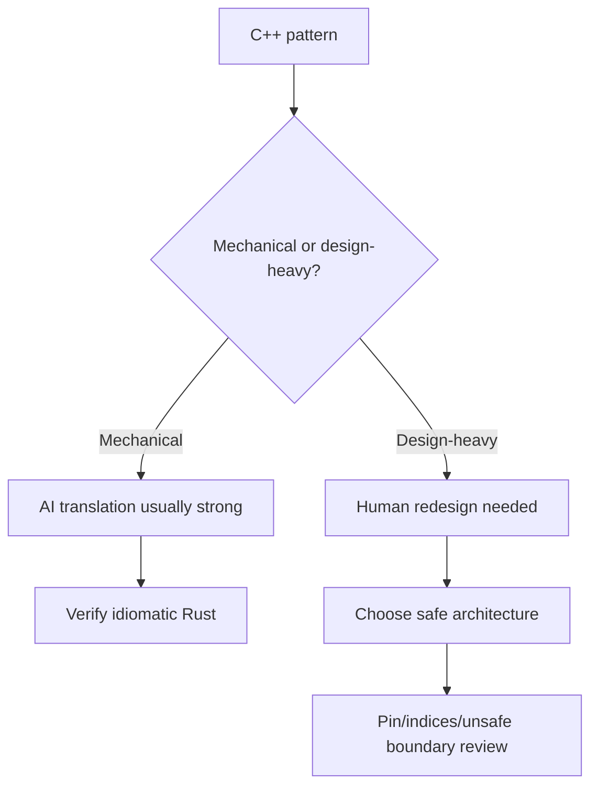
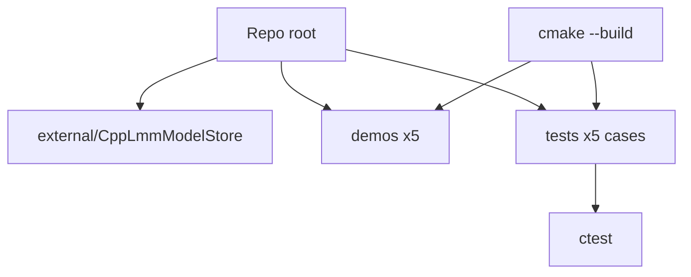

# Can AI Actually Port C++ to Rust? We Tested It.

---

There's a narrative gaining momentum in systems programming circles: AI tools are good enough now that you can point them at a C++ codebase and walk away with idiomatic, safe, production-ready Rust. Vendors imply it. Blog posts assert it. LinkedIn influencers are very confident about it.

I've been writing C++ for over 30 years. I spent years working on naval combat systems at Saab, where memory safety isn't an abstract virtue — it's a contractual obligation. I've also been learning Rust seriously for the past year. So when I hear claims about AI-powered C++-to-Rust migration, I have both the background to design a meaningful test and a professional interest in whether the answer is yes.

Spoiler: it's not yes. But the *way* it's not yes is more interesting than a simple dismissal.

---

## The Test Design

I selected four code samples that represent real porting challenges, not toy examples. Each one targets a specific class of problem that C++ and Rust handle fundamentally differently:


**Sample 1 — Shared mutable state across threads**
A producer/consumer queue using a raw mutex, with a bare pointer passed between threads. Classic C++, UB-adjacent if you squint.

**Sample 2 — CRTP (Curiously Recurring Template Pattern)**
A static polymorphism pattern used extensively in performance-sensitive code. Has no direct Rust equivalent; the idiomatic translation involves traits, but getting there requires understanding *why* CRTP exists.

**Sample 3 — RAII resource wrapper with custom deleter**
A `unique_ptr`-style wrapper around a file descriptor, with a function pointer as the deleter. Tests understanding of Rust's `Drop` trait and lifetime semantics.

**Sample 4 — A self-referential struct**
A struct containing a pointer to one of its own fields, used for an intrusive linked list. This is the hardest class of problem in Rust — it requires either `unsafe`, `Pin`, or a complete architectural rethink.

I ran each sample through four tools: **Claude (Sonnet)**, **GPT-4o**, **Gemini 1.5 Pro**, and **Copilot** (via VS Code with the chat panel). I asked each the same thing:

> *"Port this C++ to idiomatic, safe Rust. Explain any significant design decisions you made."*

I then evaluated each output on three axes:

- **Compilation** — does it compile at all?
- **Correctness** — does it do what the original did?
- **Idiomaticity** — does it look like Rust, or like C++ wearing a Rust costume?

---

## Results

### Sample 1: Shared Mutable State

This is where all four tools looked most confident and performed best. The translation from `std::mutex` + raw pointer to `Arc<Mutex<T>>` is well-documented, frequently appears in training data, and maps cleanly.

All four tools produced code that compiled. All four were correct. The idiomatic quality varied — GPT-4o and Claude both reached for `Arc<Mutex<VecDeque<T>>>` naturally, which is the right call. Gemini added an unnecessary `unsafe` block that wasn't required. Copilot produced working code but used `.unwrap()` liberally without comment, which in a production codebase is a smell worth flagging.

**Verdict: All pass. This is solved territory.**

---

### Sample 2: CRTP

This is where things got interesting.

CRTP in C++ looks like this:

```cpp
template <typename Derived>
struct Shape {
    double area() const {
        return static_cast<const Derived*>(this)->area_impl();
    }
};

struct Circle : Shape<Circle> {
    double area_impl() const { return 3.14159 * r * r; }
    double r;
};
```

The *purpose* is static dispatch — no vtable, no virtual calls, full inlining at compile time. The Rust equivalent isn't inheritance; it's a trait with a blanket impl or a generic function bounded on that trait.

Claude and GPT-4o both translated this to a `trait Shape` with an `area()` method, which compiles and is correct in terms of behaviour. But neither explained that they'd silently shifted from static dispatch via monomorphisation to dynamic dispatch via trait objects in their example — until I pushed back and asked. When I did, Claude caught itself and produced a revised version using `impl Trait` in function signatures that preserved the zero-cost nature of the original. GPT-4o's second attempt was less clean.

Gemini translated CRTP to a trait but then demonstrated its usage with `dyn Shape` — a vtable, the exact thing CRTP exists to avoid. The code compiled and was correct in behaviour but wrong in spirit. For game engine or real-time control systems code where this pattern typically appears, that's a material difference.

Copilot, working inline without a conversational interface to push back through, just gave me the `dyn` version and stopped.

**Verdict: Claude passes on reflection; others range from incomplete to semantically wrong. None volunteered the performance implication.**

---

### Sample 3: RAII Wrapper with Custom Deleter

The C++ version:

```cpp
struct FileHandle {
    int fd;
    void (*cleanup)(int);
    
    FileHandle(int fd, void(*cleanup)(int)) : fd(fd), cleanup(cleanup) {}
    ~FileHandle() { if (fd >= 0) cleanup(fd); }
    
    FileHandle(const FileHandle&) = delete;
    FileHandle& operator=(const FileHandle&) = delete;
};
```

The natural Rust translation is a struct implementing `Drop`. The function pointer becomes a stored `fn(i32)` or a boxed closure depending on requirements.

All four tools got the `Drop` impl right. The interesting divergence was in how they handled the function pointer. Claude stored it as `fn(i32)` and noted the distinction between `fn` (function pointer) and `Fn` (closure trait). GPT-4o also handled this correctly. Gemini stored it as `Box<dyn Fn(i32)>` — heap allocating a closure for what was a plain function pointer, adding overhead that wasn't in the original. Copilot got it right.

The subtler thing none of them did spontaneously: in the original, `fd >= 0` is a guard. In the Rust version, the `Option<i32>` pattern is the idiomatic way to express a "possibly-invalid handle." Only Claude produced this version when I asked for the most idiomatic translation possible, not just a working one.

**Verdict: Functional passes across the board; idiomaticity requires prompting.**

---

### Sample 4: The Self-Referential Struct

This is the wall.

```cpp
struct Node {
    int value;
    Node* next;  // points into the same allocation in some uses
};
```

In its intrusive list form — where `next` points into the current object during construction — this is genuinely hard to express safely in Rust. The borrow checker exists precisely to reject this pattern, because it can lead to dangling pointers if the struct moves.

The correct Rust approaches are:
1. Use `unsafe` and accept the responsibility
2. Use `Pin<Box<Node>>` to prevent movement
3. Redesign using indices into a `Vec` instead of pointers (often the best answer)
4. Use a crate like `intrusive-collections`

What did the tools do?

**Claude** produced a `Pin<Box<Node>>` version, explained why, and mentioned the index-based alternative as an architectural note. It was the only tool that correctly framed this as a design decision rather than a translation task.

**GPT-4o** produced an `unsafe` version that compiled, with a comment saying "this is safe in practice." That comment is doing a lot of work. The code had a potential dangling pointer if `Node` was moved before the self-reference was set up. It was subtly wrong.

**Gemini** produced code that didn't compile, then after one correction produced an `unsafe` version similar to GPT-4o's with the same latent issue.

**Copilot** produced a version that compiled but silently removed the self-referential nature entirely — it just made `next` an `Option<Box<Node>>`, which is a heap-allocated singly-linked list, not an intrusive list. It solved a different problem and didn't say so.

**Verdict: This is where the gap between tools becomes a production risk. Claude is the only one that framed the question correctly.**

---

## What This Actually Tells Us

A few things stand out after running this test.



**The easy stuff is genuinely solved.** Mutex translation, basic ownership patterns, RAII → Drop — any of these tools will get you there for standard patterns. If you have a codebase full of `shared_ptr` and `mutex`, AI-assisted porting will save you significant time.

**The hard stuff requires domain knowledge the tools don't have.** CRTP exists for a reason. Intrusive lists exist for a reason. When AI translates away the mechanism without preserving the intent, the output compiles, passes tests, and silently degrades performance or correctness in production. In real-time or safety-critical systems, that's not a minor issue.

**"Idiomatic" requires a second prompt.** Every tool produced more idiomatic Rust when explicitly asked for it. None led with it. The implication is that AI tools are calibrated toward working code first, which makes sense for most users but undersells Rust's actual value proposition. The whole point of Rust is that the type system enforces constraints the compiler can check — if AI porting quietly replaces those constraints with runtime checks or heap allocations, you're not getting Rust, you're getting slow C++ with different syntax.

**The self-referential case is a litmus test for genuine understanding.** An AI that treats it as a translation problem is guessing. An AI that treats it as a design question is reasoning. That distinction matters enormously for production migrations.

---

## Practical Guidance

If you're planning a real C++-to-Rust migration and want to use AI assistance:

**Use it for:** ownership pattern translation, standard library API mapping, `unsafe` block identification, test scaffolding, documentation of what the Rust version is doing vs. the original.

**Don't trust it for:** anything involving static polymorphism and performance intent, self-referential or intrusive data structures, any code where the *reason* for a pattern matters as much as the pattern itself.

**Always ask twice.** First prompt: "port this." Second prompt: "is this idiomatic? what would a senior Rust engineer change?" The delta between those two answers is where the real value is.

**Treat `unsafe` in AI output as a flag, not a solution.** When a tool reaches for `unsafe`, it usually means it found the hard case and gave up. That's valuable information — it's pointing at the part of your codebase that needs a human with Rust expertise to redesign, not just translate.

---

## Conclusion

Can AI port C++ to Rust? Yes, with significant caveats, and the caveats scale directly with code complexity. For modern, idiomatic C++ using standard patterns, AI tools are genuinely useful accelerators. For the parts of C++ codebases that exist precisely because of low-level performance requirements — the parts that often live in game engines, real-time systems, and safety-critical software — AI porting is a starting point at best and a liability at worst.

The most honest framing is this: AI is good at the mechanical parts of porting, and C++-to-Rust migration is mostly not mechanical. It's a series of design decisions about what you want to preserve from the original and what you want to let the new language improve. That's still a job for an engineer.

For now.

---

## Repository Companion

This repository now includes executable artifacts that mirror the four migration patterns discussed above:



- `external/CppLmmModelStore` added as a git submodule.
- `CMakeLists.txt` at the repository root to build demos and tests.
- `demos/` containing five runnable examples.
- `tests/cpp_to_rust_tests.cpp` containing five conversion-focused tests.

Quick run flow:

```bash
git submodule update --init --recursive
cmake -S . -B build
cmake --build build -j
ctest --test-dir build --output-on-failure
```

Model store path note:
- Default is `~/.local/share/deepseek/models`.
- `/tmp/...` overrides are only for restricted sandbox runs via `DEEPSEEK_MODEL_HOME`.

---

*The author, [Christian Schladetsch](mailto:christian.schladetsch@gmail.com) is a Principal C++ Engineer with 30+ years of systems programming experience, including work on naval combat systems and distributed computing infrastructure. He is currently learning Rust.*
