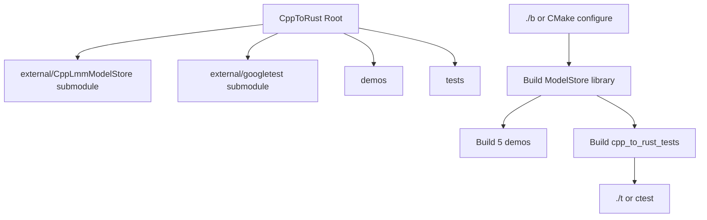
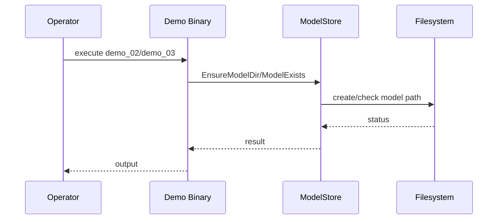

# CppToRust

Companion project for the article on AI-assisted C++ to Rust migration.



## Included

- `external/CppLmmModelStore` git submodule
- `external/googletest` git submodule
- 5 demos in `demos/`
- 40 C++->Rust conversion tests in `tests/cpp_to_rust_tests.cpp` (GoogleTest)

## Setup

```bash
git submodule update --init --recursive
```

## Build

```bash
./b
```

## Demo Execution

```bash
./build/demo_01_resolve_paths deepseek-r1
DEEPSEEK_MODEL_HOME=/tmp/deepseek_models_demo ./build/demo_02_ensure_model_dir deepseek-r1
DEEPSEEK_MODEL_HOME=/tmp/deepseek_models_demo ./build/demo_03_model_exists deepseek-r1
./build/demo_04_stream_parser_basic
./build/demo_05_stream_parser_chunked
```



Notes:
- `ModelStore` default location is `~/.local/share/deepseek/models`.
- `DEEPSEEK_MODEL_HOME=/tmp/...` in demo commands is only for restricted sandbox runs.

## Test Execution

```bash
./t
```
